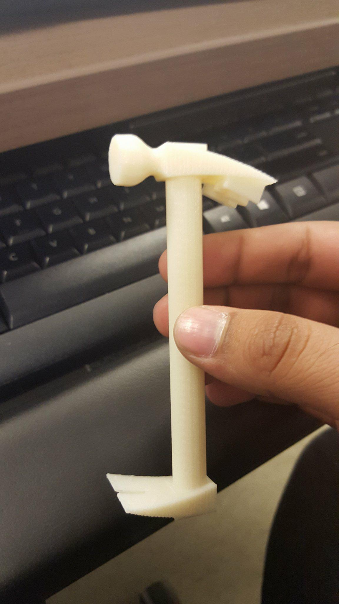

# Redesigned_Hammer

Through extensive research, it is evident that when repeating the motion of removing a nail, the body is in an injury prone positon. Knowing this, the placement of the claw was relocated to the bottom of the handle, of the hammer, facing the same direction as the hammer head.  This idea improves both the ergonomics and the functionality of the hammer.

## Dimensions 1 of 2

## Dimensions 2 of 2

## Final Production

## .stl View

