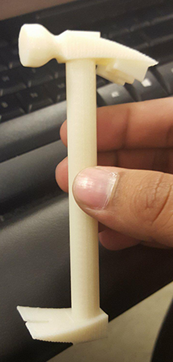
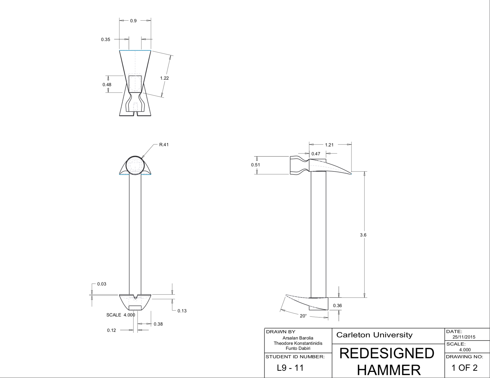
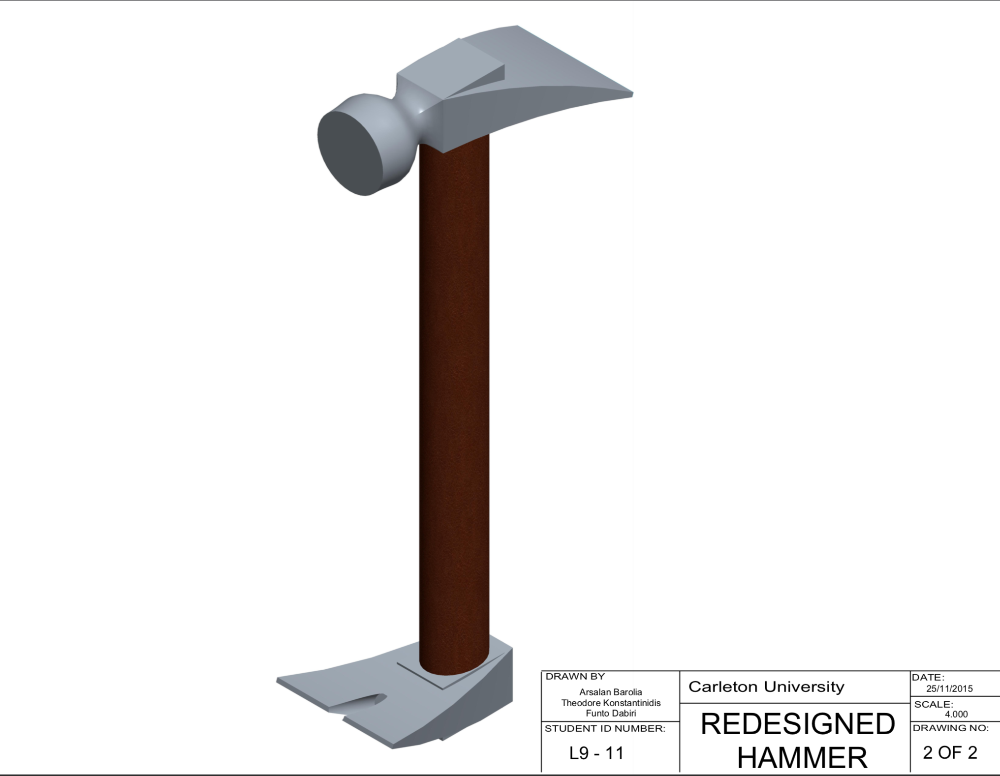

# Reverse Engineering a Hammer

    

> Brainstorming, building, and redesigning a hammer to be ergonically friendly through reverse engineering methods.

---

### Table of Contents

- [Description](#description)
- [Dimensions and Results](#dimensions-and-results)
- [Contributions](#contributions)
- [Author Info](#author-info)

---

## Description

Through extensive research, it was evident that when repeating the motion of removing a nail, the body is in an injury prone positon. Knowing this, the placement of the claw was relocated to the bottom of the hammer - facing the same direction as the hammer head. This idea improves both the ergonomics and the functionality of the hammer.

A [.stl file](files/hammer_final.stl) is attached above for further inspection of the CAD data.

[Back To The Top](#project)

---

## Dimensions and Results

 

 

 

[Back To The Top](#project)

---

## Contributions

<h4> Theo Konstantinidis</h4>

- LinkedIn - [https://ca.linkedin.com/in/theo-konstantinidis-1b0b25126](https://ca.linkedin.com/in/theo-konstantinidis-1b0b25126)

<h4> Funto Dabiri</h4>

- LinkedIn - [https://www.linkedin.com/in/funto-dabiri/](https://www.linkedin.com/in/funto-dabiri/)

[Back To The Top](#project)

---

## Author Info

<h4> Arsalan Barolia</h4>

- LinkedIn - [https://www.linkedin.com/in/arsalanbarolia/](https://www.linkedin.com/in/arsalanbarolia/)
- GitHub - [https://github.com/arsalanbarolia](https://github.com/arsalanbarolia)
- Website - [Enter domain here](enter domain here)

[Back To The Top](#project)

---
